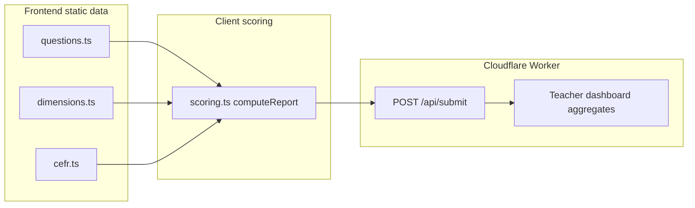
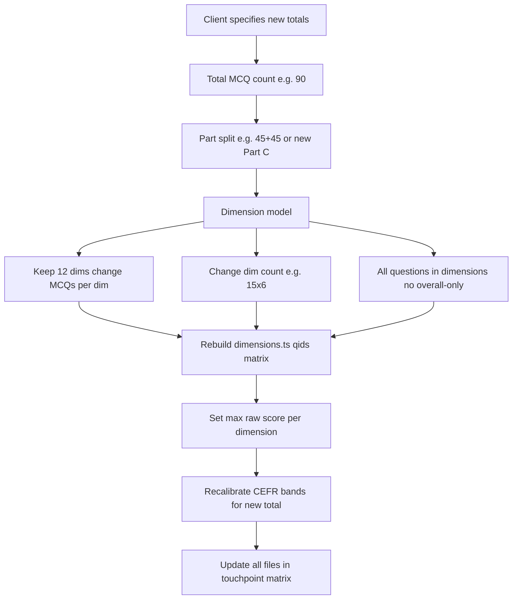

# EDT Test Bank Guide

This document is the source of truth for **question content, scoring dimensions, and CEFR mapping** on the English Diagnostic Test platform. Read it before adding, removing, or remapping MCQs — especially when using an LLM to assist.

For UI and branding rules, see [`AGENTS.md`](AGENTS.md).

---

## 1. Architecture and scope

### There is no question database

MCQ content is **not** stored in Cloudflare D1. The test bank lives in **frontend TypeScript static files**. D1 only stores:

| D1 table | Purpose |
|----------|---------|
| `vouchers` | Access codes |
| `sessions` | Active quiz sessions |
| `submissions` | Completed reports (JSON payload + denormalized scores) |
| `teacher_credentials` | Teacher dashboard access |

SQL migrations under `migrations/` do **not** seed or version question content. Do not search for question seed scripts.

### Data flow



Scoring runs **entirely in the browser** (`computeReport`). The worker stores the result and aggregates it for the teacher dashboard; it does **not** re-score answers.

---

## 2. Current model (as of v3.0.0)

| Concept | Value | Source file |
|---------|-------|-------------|
| Total MCQs | **90** | `frontend/src/data/questions.ts` |
| Part A (applied grammar) | 60 (`A1`–`A60`, canonical 1–60) | same |
| Part B (vocabulary) | 30 (`B1`–`B30`, canonical 61–90) | same |
| Part B vocab I | 15 (`B1`–`B15`, canonical 61–75) | `PART_B_VOCAB_I` |
| Part B vocab II | 15 (`B16`–`B30`, canonical 76–90) | `PART_B_VOCAB_II` |
| Scoring dimensions | **12** (Part A grammar only) | `frontend/src/data/dimensions.ts` |
| MCQs per dimension | **5** (raw score 0–5) | same |
| Dimension-scored MCQs | **60** (12 × 5, all Part A) | client grammar matrix |
| Overall-only MCQs | **30** (all Part B) | `OVERALL_ONLY_QIDS` |
| Quiz time limit | 60 minutes (`TOTAL_SECS = 3600`) | `frontend/src/lib/scoring.ts` |
| CEFR bands | 0–90 scale | `frontend/src/data/cefr.ts` |
| Report version | `3.0.0` | `APP_VERSION` in `scoring.ts` |

### Grammar dimension matrix (Part A only)

Dimensions use the client-specified question numbers (not the legacy diagonal stripe). Example — dimension 1 (Tenses):

```ts
{ id: 1, key: 'tenses', name: 'Tenses', short: 'Tenses',
  canonicalNumbers: [7, 8, 20, 27, 37],
  qids: ['A7', 'A8', 'A20', 'A27', 'A37'] }
```

All **30 Part B** questions (`B1`–`B30`) are **outside** the radar matrix. They count toward Part B (including vocab I / II sub-scores), overall score, and CEFR band only.

### Full dimension table

| id | key | name | qids |
|----|-----|------|------|
| 1 | `tenses` | Tenses | A7, A8, A20, A27, A37 |
| 2 | `adjectiveClauses` | Adjective Clauses | A4, A5, A6, A38, A39 |
| 3 | `nounClauses` | Noun Clauses | A26, A30, A40, A41, A42 |
| 4 | `adverbialClausesReasons` | Adverbs/Adverbial Clauses I | A9, A11, A28, A43, A44 |
| 5 | `adverbialClausesMannerTimePlace` | Adverbs/Adverbial Clauses II | A10, A13, A25, A45, A46 |
| 6 | `adverbialClausesConcession` | Adverbs/Adverbial Clauses III | A19, A31, A32, A55, A56 |
| 7 | `conditionals` | Conditionals | A16, A22, A23, A49, A50 |
| 8 | `activePassive` | Active vs Passive | A1, A2, A3, A51, A52 |
| 9 | `gerundsInfinitives` | Gerunds & Infinitives | A21, A24, A29, A53, A54 |
| 10 | `reportedSpeech` | Reported Speech & Reported Questions | A17, A18, A36, A57, A58 |
| 11 | `collocationsPrepositions` | Collocations & Prepositions | A12, A14, A15, A47, A48 |
| 12 | `subjectVerbAgreement` | Subject-verb Agreement | A33, A34, A35, A59, A60 |

### CEFR bands (0–90 scale)

| Band | Raw score range | Approx. IELTS | Approx. TOEFL iBT |
|------|-----------------|---------------|-------------------|
| ≤A2 | 0–26 | ≤ 3.5 | ≤ 45 |
| B1 | 27–40 | 4.0–5.0 | ~42–71 |
| B2 | 41–56 | 5.5–6.5 | ~72–94 |
| C1 | 57–74 | 7.0–8.0 | ~95–114 |
| C2 | 75–90 | 8.5–9.0 | ~115–120 |

IELTS/TOEFL mappings are **approximate** — see `PROFICIENCY_DISCLAIMER` in `cefr.ts` and `report.proficiencyDisclaimer` in i18n.

### Scoring rules

1. **Always score by stable question ID** (`A1`, `B13`, …), never by shuffled display index. `QuizScreen` shuffles questions at runtime; `computeReport` keys answers by `id`.
2. **Per-dimension score** = count of correct answers among that dimension's `qids` (max 5 today).
3. **Dimension level** (`getDimensionLevel` in `scoring.ts`):

   | Correct (of 5) | level | levelKey |
   |----------------|-------|----------|
   | 0–1 | 1 | `needsWork` |
   | 2 | 2 | `developing` |
   | 3 | 3 | `good` |
   | 4 | 4 | `strong` |
   | 5 | 5 | `excellent` |

4. **Weak dimensions**: any dimension with `level <= 2`.
5. **Feedback is not per-question**. Dimension narratives are generic by `levelKey` in `frontend/src/i18n/messages.ts` (`report.dimensionNarratives`). CEFR band text lives in `cefr.ts`. The question review on the results page shows user answer vs correct option text only — no rationale.

---

## 3. Data schemas

### Question (`frontend/src/data/questions.ts`)

```ts
export type OptionKey = 'A' | 'B' | 'C' | 'D';

export type Question = {
  id: string;              // e.g. 'A1', 'B25'
  canonicalNumber: number; // global order 1…N
  part: 'A' | 'B';
  text: string;            // stem
  opts: Array<{ k: OptionKey; t: string }>; // exactly four options
};
```

Exports:

- `PART_A` — grammar questions
- `PART_B` — vocabulary / reading questions
- `ALL_QUESTIONS` — `[...PART_A, ...PART_B]`
- `ANSWER_KEY` — `Record<string, OptionKey>` with one entry per question `id`

### Dimension (`frontend/src/data/dimensions.ts`)

```ts
export type Dimension = {
  id: number;
  key: string;             // stable slug, used in stored submissions
  name: string;            // full label on report
  short: string;           // radar chart label
  canonicalNumbers: number[];
  qids: string[];
};
```

Exports:

- `DIMENSIONS` — array of 12 dimensions
- `OVERALL_ONLY_QIDS` — question IDs excluded from dimension scoring

### Report types (`frontend/src/types.ts`)

At submit time, `computeReport` produces a `ReportResult` including:

- `scores.partA` / `scores.partB` / `scores.total` — `{ correct, total, pct }`
- `dimensions` — `DimensionScore[]` with computed `score`, `level`, `levelKey`
- `cefrBand` — matched band from `CEFR_BANDS`
- `reportSnapshot.overallOnlyQids` — copy of `OVERALL_ONLY_QIDS`
- `reportSnapshot.questionCorrectness` — `{ [qid]: 0 | 1 }` for every question

The worker denormalizes `dimensions` → `submissions.dimension_scores` and `questionCorrectness` → `submissions.score_dist`.

---

## 4. ID and numbering conventions

| Rule | Detail |
|------|--------|
| Part A IDs | `A1` … `A{n}` where `n` = Part A count |
| Part B IDs | `B1` … `B{n}` where `n` = Part B count |
| `canonicalNumber` | Global sequence: Part A uses 1…60, Part B uses 61…90 |
| Stable IDs | Never renumber or reuse IDs after submissions exist in production |
| Adding questions | Prefer appending new IDs (`A37`, `B37`, …) over inserting mid-sequence |
| Part label | `'A'` = applied grammar; `'B'` = vocabulary / academic reading |

---

## 5. File touchpoint matrix

Update **every** file in this table when question count or dimension model changes.

| File | What to change |
|------|----------------|
| `frontend/src/data/questions.ts` | `PART_A`, `PART_B`, `ALL_QUESTIONS`, `ANSWER_KEY` |
| `frontend/src/data/dimensions.ts` | `DIMENSIONS`, `OVERALL_ONLY_QIDS` |
| `frontend/src/data/cefr.ts` | Band `min` / `max` thresholds (top band ends at 90) |
| `frontend/src/lib/scoring.ts` | `computeReport` totals; `getDimensionLevel` if max-per-dimension changes |
| `frontend/src/screens/ResultsScreen.tsx` | Score summary cards; CEFR IELTS/TOEFL display |
| `frontend/src/i18n/messages.ts` | Marketing copy, `report.*`, `teacher.questionTableTitle` — **both EN and zh-HK** |
| `frontend/src/screens/TeacherDashboardScreen.tsx` | Overall mean suffix `/90`, question table title |
| `worker/src/index.ts` | `SCORE_BUCKETS`, `DIMENSION_KEYS`, `ALL_QIDS_ORDERED` (60 + 30) |
| `AGENTS.md` | Test Bank and Scoring / Report Rules constants |
| `USER_GUIDE.md` | User-facing references to 72 questions and score range |

### Worker duplication warning

`worker/src/index.ts` duplicates dimension metadata from `dimensions.ts`:

- `DIMENSION_KEYS` — `id`, `key`, `name`, `short` (no `qids`)
- `SCORE_BUCKETS` — mirrors CEFR breakpoints
- `ALL_QIDS_ORDERED` — `Array.from({ length: 60 }, …)` for A and `length: 30` for B

There is no shared package today. After editing `dimensions.ts`, manually sync the worker copy or teacher dashboard aggregates will drift.

---

## 6. Invariants checklist

Run these checks before merging any test-bank change:

- [ ] `ALL_QUESTIONS.length === Object.keys(ANSWER_KEY).length`
- [ ] Every key in `ANSWER_KEY` has a matching question in `ALL_QUESTIONS`, and vice versa
- [ ] Every `qid` in `DIMENSIONS[*].qids` exists in `ANSWER_KEY`
- [ ] No `qid` appears in more than one dimension (unless intentionally redesigned)
- [ ] `OVERALL_ONLY_QIDS` ∩ (all dimension `qids`) = ∅
- [ ] Union of all dimension `qids` + `OVERALL_ONLY_QIDS` = all question IDs (currently 60 + 30 = 90)
- [ ] `canonicalNumber` values are unique and contiguous 1…N
- [ ] Each dimension has the same number of `qids` (currently 5)
- [ ] CEFR top band `max` equals total question count
- [ ] Worker `SCORE_BUCKETS` top range matches CEFR top band
- [ ] EN and zh-HK i18n strings updated for any user-visible count change
- [ ] `getDimensionLevel` thresholds still make sense if max-per-dimension score changes

---

## 7. Workflows

### Workflow A — Edit individual MCQs (same 90 / 12×5 Part A model)

1. Edit question `text` and/or `opts` in `frontend/src/data/questions.ts` for the target `id`.
2. If the correct answer changed, update `ANSWER_KEY[id]`.
3. Confirm the question's `id` is unchanged and still appears in the correct dimension's `qids` (or in `OVERALL_ONLY_QIDS`).
4. Smoke-test: start quiz → answer a few questions → submit → verify report dimension scores and question review.
5. If teacher dashboard is in scope, verify question stats for that `qid`.

### Workflow B — Expand to ~90 questions (dimension model TBD)

The client has indicated a possible target of **90 total MCQs** with a **new dimension layout not yet specified**. Do not implement until the decision table below is filled in.



#### Decision table (client to fill in)

| Decision | Previous (v2) | Current (v3) |
|----------|---------------|--------------|
| Total MCQs | 72 | 90 |
| Part A count | 36 | 60 |
| Part B count | 36 | 30 |
| Dimension count | 12 | 12 |
| MCQs per dimension | 5 | 5 |
| Overall-only MCQs | 12 (`B25`–`B36`) | 30 (all Part B) |
| Max dimension raw score | 5 | 5 |
| CEFR band breakpoints | 0–72 (B1–C2) | 0–90 (≤A2–C2) |

#### Suggested implementation order (once decisions are made)

1. Add new question objects and `ANSWER_KEY` entries in `questions.ts`.
2. Rebuild `DIMENSIONS` and `OVERALL_ONLY_QIDS` in `dimensions.ts`.
3. Update `cefr.ts` band ranges for the new 0–N scale.
4. Replace hardcoded totals in `scoring.ts`, `ResultsScreen.tsx`, `RadarChart.tsx` (or derive from data).
5. Sync `worker/src/index.ts` (`SCORE_BUCKETS`, `DIMENSION_KEYS`, `ALL_QIDS_ORDERED`).
6. Update all i18n strings (EN + zh-HK) and `USER_GUIDE.md`.
7. Run the invariants checklist (section 6).

### Workflow C — Change dimension names or keys

1. Update `DIMENSIONS` in `dimensions.ts`.
2. Sync `DIMENSION_KEYS` in `worker/src/index.ts`.
3. If dimension-specific i18n is added later, update both locales.

**Backward compatibility:** `submissions.dimension_scores` stores JSON keyed by dimension `key` strings. Renaming a `key` breaks historical teacher dashboard aggregation for that dimension unless a migration maps old keys to new ones.

---

## 8. Optional future improvements

These refactors reduce drift when counts change but are **not required** for content updates:

- Derive `PART_A.length`, `PART_B.length`, and total from arrays in `scoring.ts` and `ResultsScreen.tsx` instead of hardcoding `36` / `72`.
- Export dimension metadata from a shared module consumed by both frontend and worker.
- Add `scripts/validate-test-bank.ts` that runs the section 6 invariants automatically in CI.

---

## 9. LLM agent instructions

When an AI agent is asked to modify the test bank:

1. **Read this file first** before editing any question or dimension data.
2. **Never score by display index** — always use stable question `id` (see `AGENTS.md` Forbidden Patterns).
3. **Always update `ANSWER_KEY`** when adding or changing questions.
4. **Always sync worker duplicates** (`DIMENSION_KEYS`, `SCORE_BUCKETS`, `ALL_QIDS_ORDERED`) after dimension or count changes.
5. **Update both EN and zh-HK** strings in `messages.ts` when counts or dimension notes change.
6. **Do not change dimension `key` values** without acknowledging stored submission compatibility.
7. **List every file touched** in the PR description using the touchpoint matrix (section 5).
8. **Do not put question content in D1 migrations** — questions belong in `frontend/src/data/`.
9. **Run the invariants checklist** (section 6) and describe results in the PR.
10. For expansions beyond 72 questions, require the client decision table (section 7, Workflow B) to be filled in before implementing a new matrix.

---

## 10. Quick reference — primary source files

```
frontend/src/data/
  questions.ts    ← MCQ stems, options, answer key
  dimensions.ts   ← 12×5 matrix, overall-only IDs
  cefr.ts         ← CEFR band thresholds and copy

frontend/src/lib/
  scoring.ts      ← computeReport, getDimensionLevel, TOTAL_SECS

frontend/src/screens/
  QuizScreen.tsx       ← shuffles ALL_QUESTIONS, calls computeReport
  ResultsScreen.tsx    ← renders scores, radar, question review
  TeacherDashboardScreen.tsx ← cohort stats

worker/src/index.ts    ← submit handler, teacher dashboard aggregates
```
